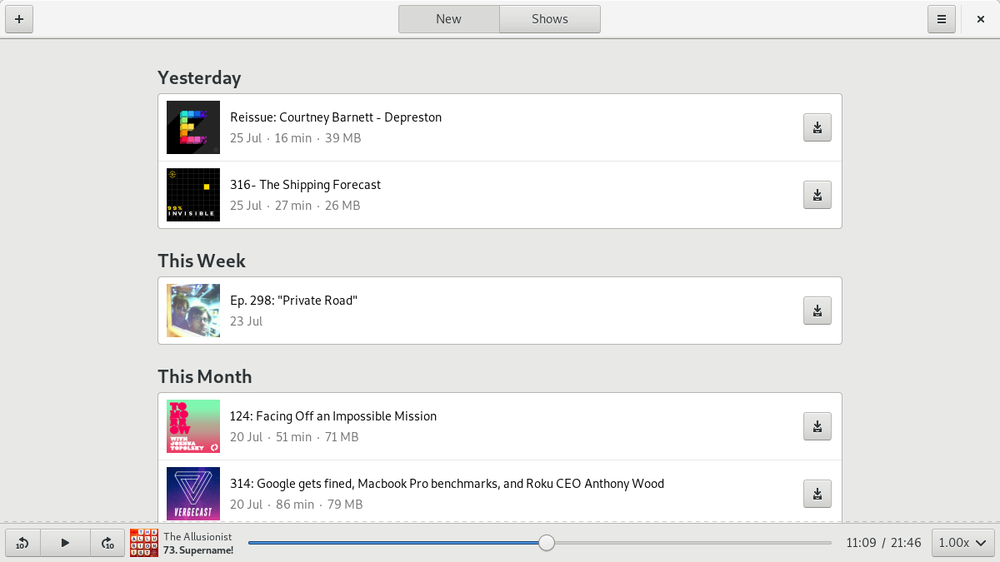
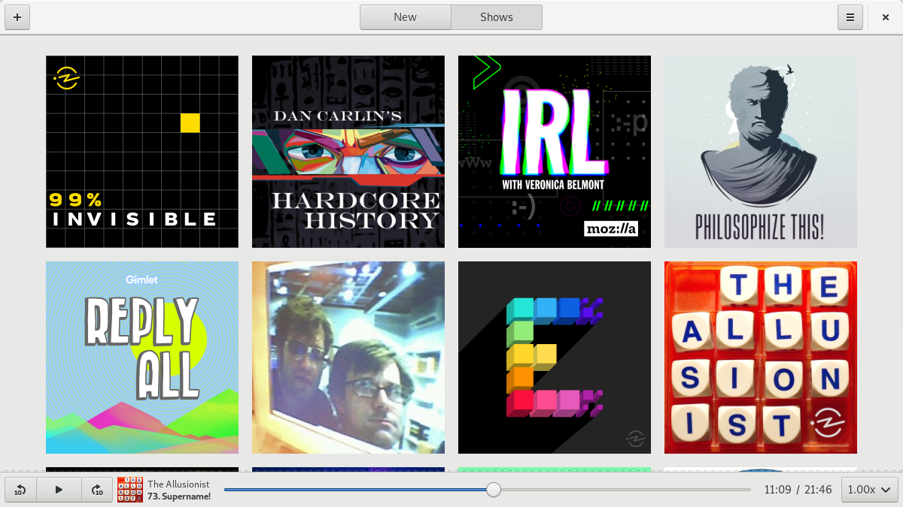

# GNOME Podcasts

### A Podcast application for GNOME.
Listen to your favorite podcasts, right from your desktop.





## Available from [Flathub](https://www.flathub.org/apps/details/org.gnome.Podcasts)

Install by clicking and opening [this](https://www.flathub.org/apps/details/org.gnome.Podcasts) with GNOME Software

### Command line options:

Make sure to follow the [setup guide][flatpak_setup] before installing

Install:
```sh
flatpak install flathub org.gnome.Podcasts
```

Run:
```sh
flatpak run org.gnome.Podcasts
```

## Quick start

GNOME Podcasts can be built and run with [Gnome Builder][builder] >= 3.28.

You can get Builder from [here][get_builder].

## Broken Feeds

Found a feed that does not work in GNOME Podcasts?
Please [open an issue][new_issue] and choose the `BrokenFeed` template so we will know and fix it!

## Getting in Touch

If you have any questions regarding the use or development of GNOME Podcasts,
want to discuss design or simply hang out, please join us on our [irc][irc] or [matrix][matrix] channel.

## Building

### Flatpak

Flatpak is the recommended way of building and installing GNOME Podcasts.

#### Building a Flatpak

Download the `org.gnome.Podcasts.json` flatpak manifest from this repo.

```sh
# Add flathub repo
flatpak --user remote-add flathub --if-not-exists https://dl.flathub.org/repo/flathub.flatpakrepo
# Add the gnome-nightly repo
flatpak --user remote-add gnome-nightly --if-not-exists https://sdk.gnome.org/gnome-nightly.flatpakrepo
# Install the gnome-nightly Sdk and Platform runtim
flatpak --user install gnome-nightly org.gnome.Sdk org.gnome.Platform
# Install the required rust-stable extension from flathub
flatpak --user install flathub org.freedesktop.Sdk.Extension.rust-stable
flatpak-builder --user --repo=repo podcasts org.gnome.Podcasts.json --force-clean
```

To install the resulting flatpak you can do:

```bash
flatpak build-bundle repo gnome-podcasts.flatpak org.gnome.Podcasts
flatpak install --user --bundle gnome-podcasts.flatpak
```

### Building from source

```sh
git clone https://gitlab.gnome.org/World/podcasts.git
cd gnome-podcasts/
meson --prefix=/usr build
ninja -C build
sudo ninja -C build install
```

#### Dependencies

* Rust stable 1.27 or later along with cargo.
* Gtk+ 3.22 or later
* Gstreamer 1.12 or later
* Meson
* A network connection

Offline build are possible too, but [`cargo-vendor`][vendor] would have to be setup first

**Debian/Ubuntu**

```sh
apt-get install -yqq cargo rustc libsqlite3-dev libssl-dev libgtk-3-dev meson \
        libgstreamer1.0-dev libgstreamer-plugins-base1.0-dev \
        gstreamer1.0-plugins-base gstreamer1.0-plugins-good \
        gstreamer1.0-plugins-bad gstreamer1.0-plugins-ugly \
        gstreamer1.0-libav libgstrtspserver-1.0-dev ibgstreamer-plugins-bad1.0-dev
```

**Fedora**

```sh
dnf install -y rust cargo gtk3-devel glib2-devel openssl-devel sqlite-devel meson \
    gstreamer1-devel gstreamer1-plugins-base-tools gstreamer1-devel-docs \
    gstreamer1-plugins-base-devel gstreamer1-plugins-base-devel-docs \
    gstreamer1-plugins-good gstreamer1-plugins-good-extras \
    gstreamer1-plugins-bad-free gstreamer1-plugins-bad-free-devel \
    gstreamer1-plugins-bad-free-extras

```

If you happen to build it on other distributions please let me know the names 
of the corresponding libraries. Feel free to open a MR or an Issue to note it.

## Contributing

There are a lot of things yet to be done.

If you want to contribute, please check the [Contributions Guidelines][contribution-guidelines].

You can start by taking a look at [Issues][issues] or by opening a [New issue][new_issue].

There are also some minor tasks tagged with `TODO:` and `FIXME:` in the source code.

[contribution-guidelines]: https://gitlab.gnome.org/World/podcasts/blob/master/CONTRIBUTING.md

### Translations

If you want to add a new language you should update the file
`podcasts-gtk/po/LINUGAS` and add the new lang to the list.

To generate .pot files you should run:

```
ninja -C _build gnome-podcasts-pot
```

To generate .po files you should run:

```
ninja -C _build gnome-podcasts-update-po
```


## Overview

```sh
$ tree -d
├── screenshots         # png's used in the README.md
├── podcasts-data        # Storate related stuff, SQLite, XDG setup, RSS Parser.
│   ├── migrations      # Diesel SQL migrations.
│   │   └── ...
│   ├── src
│   └── tests
│       └── feeds       # Raw RSS Feeds used for tests.
├── podcasts-downloader  # Really basic, Really crappy downloader.
│   └── src
├── podcasts-gtk         # The Gtk+ Client
│   ├── resources       # GResources folder
│   │   └── gtk         # Contains the glade.ui files.
│   └── src
│       ├── stacks      # Contains the gtk Stacks that hold all the different views.
│       └── widgets     # Contains custom widgets such as Show and Episode.
```

## A note about the project's name

The project used to be called Hammond, after Allan Moore's character [Evey Hammond][hammond] from the graphic novel V for Vendetta.
It was renamed to GNOME Podcasts on 2018/07/24 shortly before its first public release.

## Acknowledgments

GNOME Podcasts's design is heavily inspired by [GNOME Music][music] and [Vocal][vocal].

We also copied some elements from [GNOME News][news].

And almost the entirety of the build system is copied from the [Fractal][fractal] project.

[vendor]: https://github.com/alexcrichton/cargo-vendor
[irc]: irc://irc.gnome.org/#hammond
[matrix]: https://matrix.to/#/#gnome-podcasts:matrix.org
[flatpak_setup]: https://flatpak.org/setup/
[music]: https://wiki.gnome.org/Design/Apps/Music
[vocal]: http://vocalproject.net/
[news]: https://wiki.gnome.org/Design/Apps/Potential/News
[fractal]: https://gitlab.gnome.org/World/fractal
[hammond]: https://en.wikipedia.org/wiki/Evey_Hammond
[issues]: https://gitlab.gnome.org/World/podcasts/issues
[new_issue]: https://gitlab.gnome.org/World/podcasts/issues/new
[builder]: https://wiki.gnome.org/Apps/Builder
[get_builder]: https://wiki.gnome.org/Apps/Builder/Downloads
