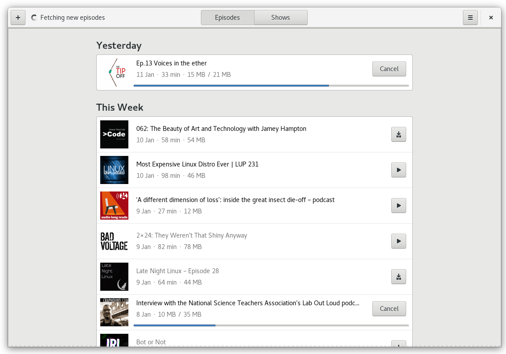
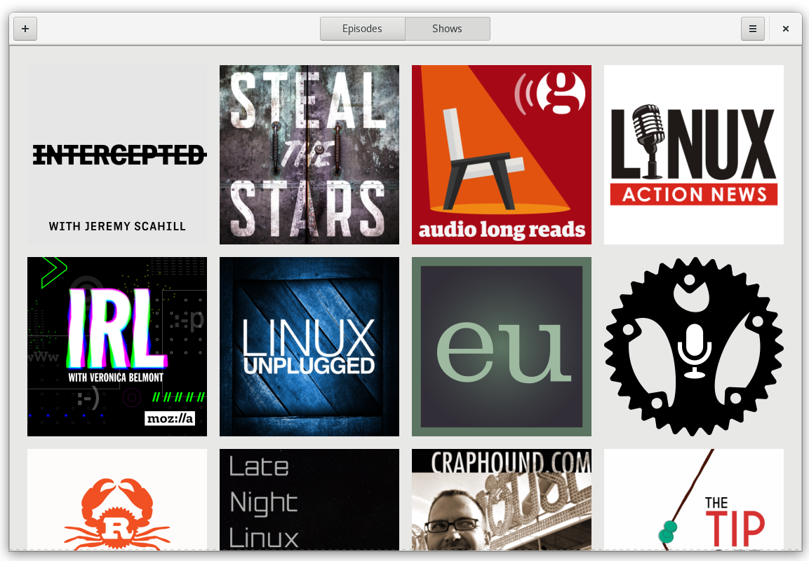
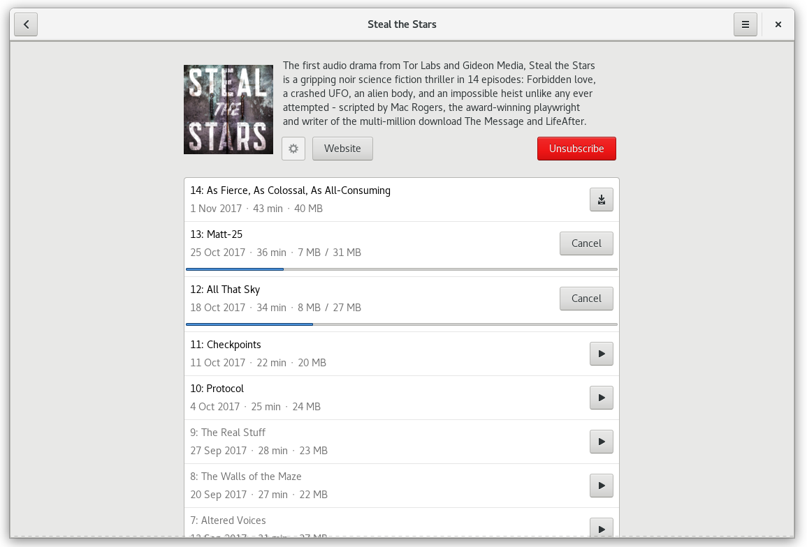

# Hammond

## A Podcast Client for the GNOME Desktop written in Rust.

[](https://gitlab.gnome.org/alatiera/Hammond/commits/master)

### Features

* TBA





## Quick start

The following steps assume you have a working installation of rustc and cargo.
If you dont take a look at [rustup.rs](rustup.rs)

```sh
git clone https://gitlab.gnome.org/alatiera/hammond.git
cd Hammond/
cargo run -p hammond-gtk --release
```

## Broken Feeds

Found a feed that does not work in Hammond?
Please [open an issue](https://gitlab.gnome.org/alatiera/Hammond/issues/new) and choose the `BrokenFeed` template so we will know and fix it!

## Getting in Touch

If you have any questions regarding the use or development of Hammond,
want to discuss design or simply hang out, please join us in [#hammond on irc.gnome.org.](irc://irc.gnome.org/#hammond)

Note:

There isn't much documentation yet, so you will probably have question about parts of the Code.

## Install from soure

```sh
git clone https://gitlab.gnome.org/alatiera/hammond.git
cd Hammond/
./configure --prefix=/usr/local
make && sudo make install
```

**Additional:**

You can run `sudo make uninstall` for removal

And `make clean` to clean up the enviroment after instalation.

### Flatpak

#### Building a Flatpak

Download the `org.gnome.Hammond.json` flatpak manifest from this repo.

```bash
flatpak remote-add --if-not-exists flathub https://dl.flathub.org/repo/flathub.flatpakrepo # Add flathub repo
flatpak --user install flathub org.freedesktop.Sdk.Extension.rust-stable # Install the required rust-stable extension from flathub
flatpak-builder --repo=repo hammond org.gnome.Hammond.json --force-clean
flatpak build-bundle repo hammond org.gnome.hammond
```

## Building

### Dependencies

* Rust stable 1.22 or later.
* Gtk+ 3.22 or later
* Meson

**Debian/Ubuntu**

```sh
apt-get update -yqq
apt-get install -yqq --no-install-recommends build-essential
apt-get install -yqq --no-install-recommends libgtk-3-dev meson
```

**Fedora**

```sh
dnf install -y gtk3-devel glib2-devel openssl-devel sqlite-devel meson
```

If you happen to build it on other distributions please let me know the names of the corresponding libraries. Feel free to open a PR or an Issue to note it.

```sh
git clone https://gitlab.gnome.org/alatiera/Hammond.git
cd Hammond/
cargo build --all
```

## Contributing

There alot of thins yet to be done.

If you want to contribute, please check the [Contributions Guidelines][contribution-guidelines].

You can start by taking a look at [Issues](https://gitlab.gnome.org/alatiera/Hammond/issues) or by opening a [New issue](https://gitlab.gnome.org/alatiera/Hammond/issues/new?issue%5Bassignee_id%5D=&issue%5Bmilestone_id%5D=).

There are also some minor tasks tagged with `TODO:` and `FIXME:` in the source code.

[contribution-guidelines]: https://gitlab.gnome.org/alatiera/Hammond/blob/master/CONTRIBUTING.md


## Overview

```sh
$ tree -d
├── assets              # png's used in the README.md
├── hammond-data        # Storate related stuff, SQLite, XDG setup, RSS Parser.
│   ├── migrations      # Diesel SQL migrations.
│   │   └── ...
│   ├── src
│   └── tests
│       └── feeds       # Raw RSS Feeds used for tests.
├── hammond-downloader  # Really basic, Really crappy downloader.
│   └── src
├── hammond-gtk         # The Gtk+ Client
│   ├── resources       # GResources folder
│   │   └── gtk         # Contains the glade.ui files.
│   └── src
│       ├── views       # Contains the Empty, Episodes and Shows view.
│       └── widgets     # Contains custom widgets such as Show and Episode.
```

## A note about the project's name

The project was named after Allan Moore's character [Evey Hammond](https://en.wikipedia.org/wiki/Evey_Hammond) from the graphic novel V for Vendetta.

It has nothing to do with the horrible headlines on the news.

## Acknowledgments

Hammond's design is heavily insired by [GNOME Music](https://wiki.gnome.org/Design/Apps/Music) and [Vocal](http://vocalproject.net/).

We also copied some elements from [GNOME News](https://wiki.gnome.org/Design/Apps/Potential/News).

And almost the entirety of the build system is copied from the [Fractal](https://gitlab.gnome.org/danigm/fractal) project.

